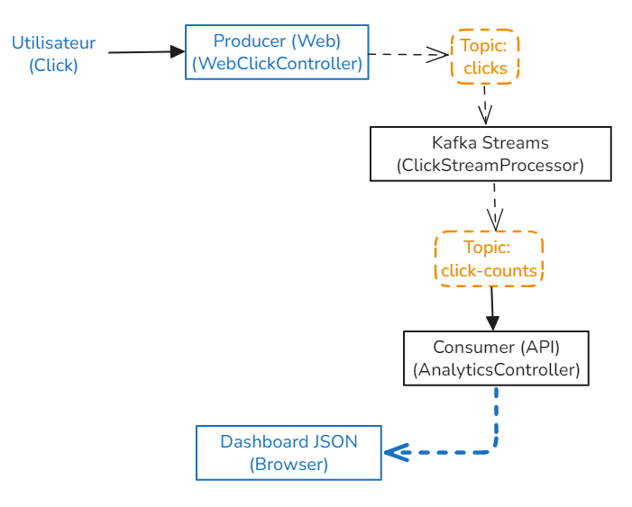
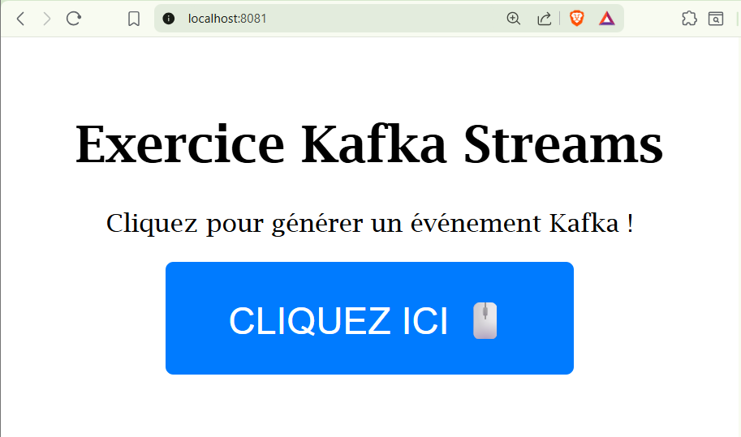
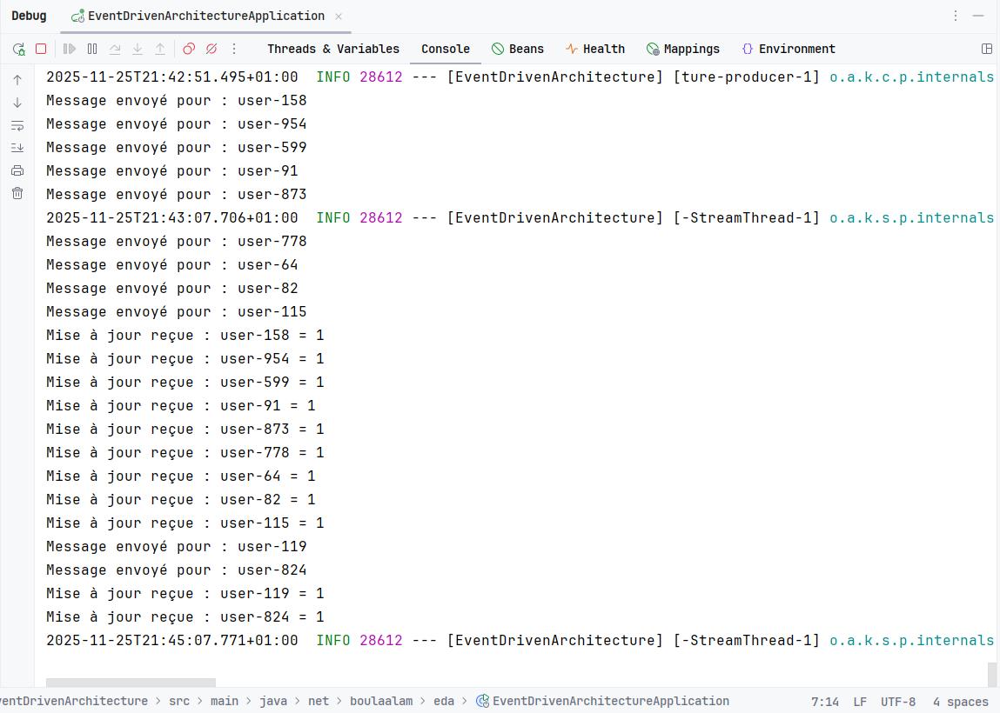
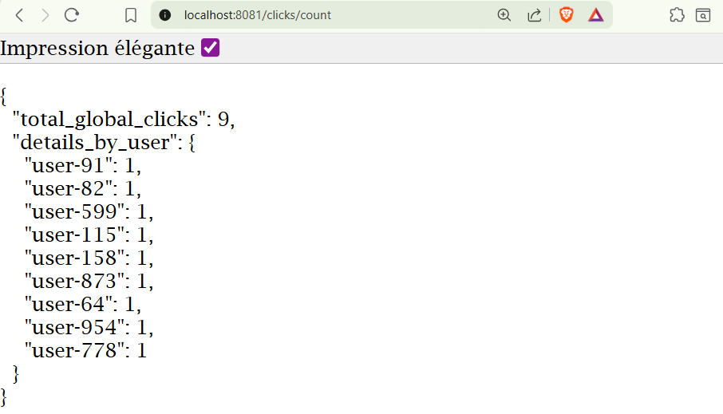

# Real-Time Click Analytics avec Spring Boot & Kafka Streams 🚀


Une application complète d'architecture orientée événements (**EDA**) qui suit et compte les interactions utilisateurs en temps réel. Le projet démontre l'intégration transparente de **Kafka Streams** dans l'écosystème **Spring Boot**.

## 🏗️ Architecture du Projet

Le flux de données traverse trois composants découplés au sein de l'application modulaire :

1.  **Producer (Web)** : Interface utilisateur Thymeleaf générant des événements "Click".
2.  **Processor (Stream)** : Topologie Kafka Streams effectuant une agrégation (`count`) par utilisateur en temps réel.
3.  **Consumer (Analytics)** : API REST exposant les résultats agrégés depuis une KTable/StateStore.

4. 

## 📂 Structure du Code
Le projet respecte une architecture claire et modulaire :

```Plaintext
src/main/java/net/boulaalam/eda
├── config      # Configuration automatique des Topics Kafka
├── consumer    # Consommateur qui expose les données via REST
├── producer    # Contrôleur Web qui publie les événements
└── stream      # Logique de traitement Kafka Streams
```

## 📸 Démonstration
### 1. Interface Producteur
L'utilisateur interagit avec l'interface web simple.

**Sortie :**


### 2. Console & Logs
Visualisation des logs de traitement en temps réel.

**Sortie :**


### 3. API Analytics (Résultat JSON)
Les données agrégées sont disponibles instantanément via l'API.

**Sortie :**


## 🚀 Installation et Démarrage

### Prérequis
- Java JDK 17+ (Testé avec Java 23)
- Docker & Docker Compose
- Maven

### Étape 1 : Démarrer l'infrastructure
Lancez le cluster Kafka via Docker :

```Bash
docker-compose up -d
```

### Étape 2 : Lancer l'application
Compilez et exécutez le projet Spring Boot :
```Bash
mvn spring-boot:run
```

*L'application créera automatiquement les topics clicks et click-counts au démarrage.*

## 🧪 Utilisation

1. **Accéder à l'interface de simulation** : Ouvrez http://localhost:8081 dans votre navigateur et cliquez sur le bouton.
2. **Consulter les statistiques** : Ouvrez http://localhost:8081/clicks/count pour voir le compteur JSON s'incrémenter en temps réel.

## 🛠️ Stack Technique
- **Core** : Java 23, Spring Boot 3
- **Messaging** : Apache Kafka, Kafka Streams
- **Frontend** : Thymeleaf, HTML5
- **Build Tool** : Maven

## 👤 Auteur
**Mohamed BOULAALAM** - Étudiant en Ingénierie Informatique, Big Data et Cloud Computing.

## 👤 Encadré par
**Pr Abdelmajid BOUSSELHAM**